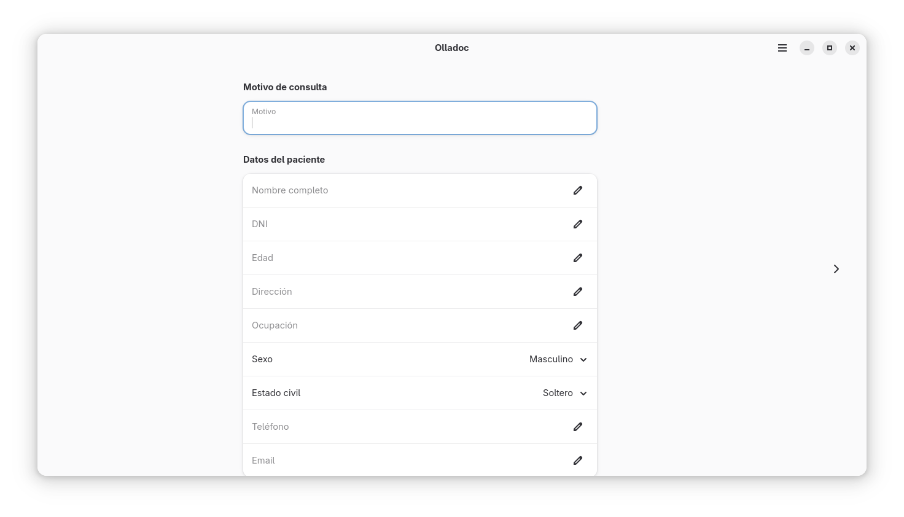
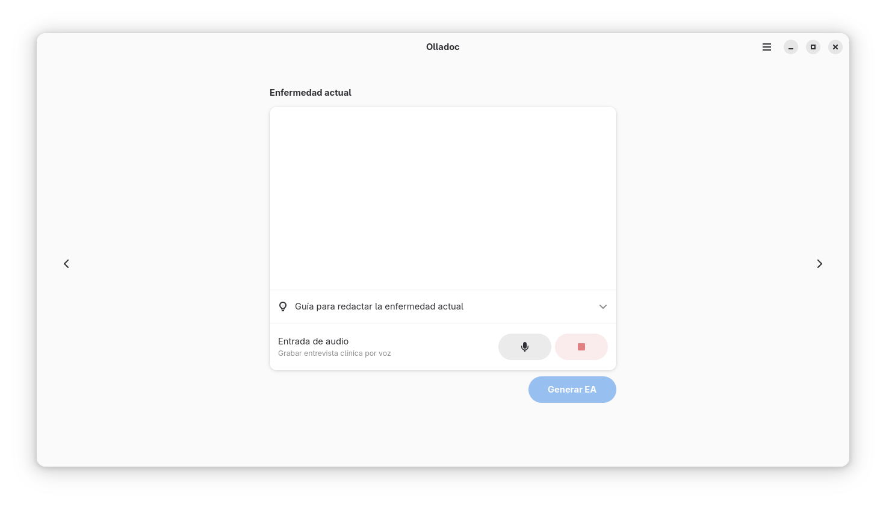
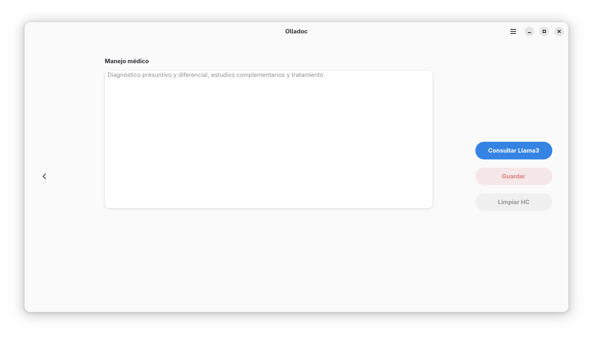

<p align="center">
  
</p>

<h1 align="center">🩺 Olladoc</h1>

<p align="center">
  Aplicación médica moderna desarrollada con <b>GTK 4</b> y <b>libadwaita</b>, diseñada para generar historias clínicas profesionales con entrada por voz e inteligencia artificial.
</p>

<p align="center">
  
</p>

---

## 🚀 Características destacadas

- 🧠 Entrada por voz y texto para anamnesis rápida
- 📄 Generación de historia clínica en PDF
- 🤖 Orientación diagnóstica con IA local (Ollama + Llama3)
- 🩺 Flujo clínico profesional con AdwNavigationView
- 🎨 Interfaz moderna con diseño limpio y responsivo
- 🐧 Compatible con Flatpak y Flathub

---

## 📷 Capturas de pantalla

| Inicio | Consulta |
|--------|----------|
|  |  |

---

## Instalación desde Flatpak

### 1. Añadir el repositorio

Para añadir el repositorio de la aplicación **Olladoc**, abre una terminal y ejecuta:

```bash
flatpak remote-add --user --if-not-exists --no-gpg-verify thorhent-olladoc https://thorhent.github.io/Olladoc/Olladoc.flatpakrepo
```

### 2. Actualizar el repositorio (opcional)

```bash
flatpak update --user thorhent-olladoc
```

### 3. Instalar la aplicación

```bash
flatpak install thorhent-olladoc io.github.thorhent.Olladoc
```

### 4. Ejecutar la aplicación

```bash
flatpak run io.github.thorhent.Olladoc
```

### 5. Desinstalar la aplicación (opcional)

```bash
flatpak uninstall io.github.thorhent.Olladoc
flatpak remote-delete thorhent-olladoc
```

> 💡 **Nota:** La instalación se realiza con la opción `--user`, lo que significa que queda disponible solo para el usuario actual. Si deseas instalarla a nivel del sistema, omite `--user`.

---

## 🐑 Cómo instalar Ollama y modelos

Olladoc depende de [Ollama](https://ollama.com/) para ejecutar modelos de lenguaje localmente.  
A continuación se explican los pasos de instalación en Fedora (recomendado) y en Ubuntu/Debian.

---

### 🔹 Fedora (42)

```bash
sudo dnf install ollama
```

### 🔹 Ubuntu/Debian 

```bash
curl -fsSL https://ollama.com/install.sh | sh
```

---

### 📥 Instalar modelos Ollama

Recomendados:  
- `qwen3-vl:235b-cloud`  
- `gpt-oss:120b-cloud`  
- `gpt-oss:20b-cloud`

```bash
ollama pull qwen3-vl:235b-cloud
ollama pull gpt-oss:120b-cloud
ollama pull gpt-oss:20b-cloud
```


