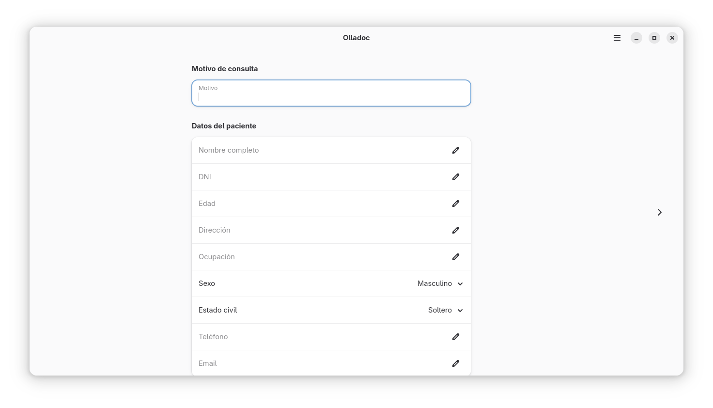
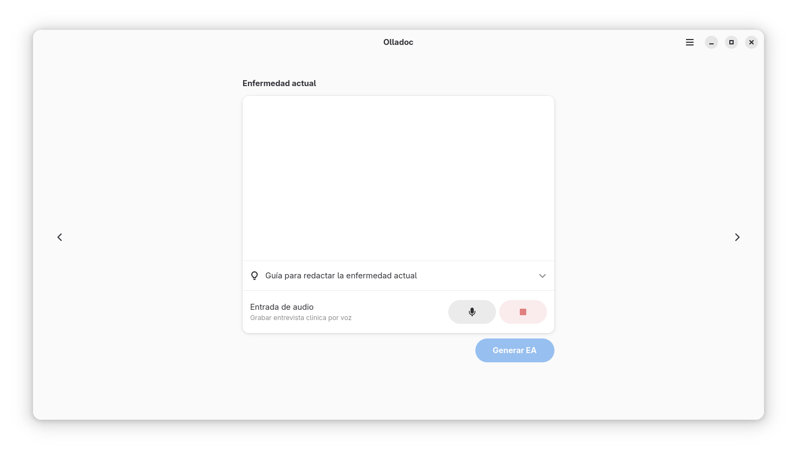
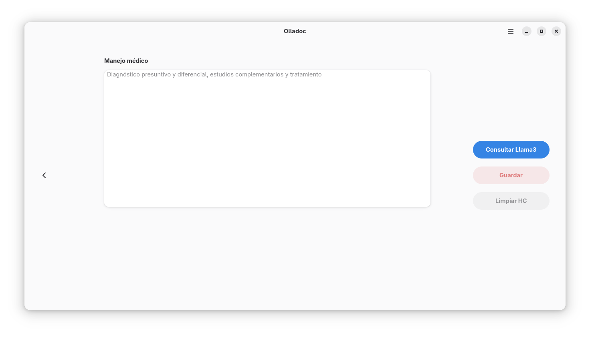

<p align="center">
  
</p>

<h1 align="center">🩺 Olladoc</h1>

<p align="center">
  Aplicación médica moderna desarrollada con <b>GTK 4</b> y <b>libadwaita</b>, diseñada para generar historias clínicas profesionales con entrada por voz e inteligencia artificial.
</p>

<p align="center">
  
</p>

---

## 🚀 Características destacadas

- 🧠 Entrada por voz y texto para anamnesis rápida
- 📄 Generación de historia clínica en PDF
- 🤖 Orientación diagnóstica con IA local (Ollama + Llama3)
- 🩺 Flujo clínico profesional con AdwNavigationView
- 🎨 Interfaz moderna con diseño limpio y responsivo
- 🐧 Compatible con Flatpak y Flathub

---

## 📷 Capturas de pantalla

| Inicio | Consulta |
|--------|----------|
|  |  |

---

## 🧪 Cómo ejecutar localmente (Flatpak)

### 📦 1. Construcción, prueba e instalación

Para construir el proyecto Flatpak desde cero y limpiar cualquier compilación anterior, usa el siguiente comando:

```bash
flatpak-builder --force-clean build-dir com.github.thorhent.Olladoc
```

Ejecutar el proyecto Flatpak
Una vez que el proyecto esté construido, puedes ejecutar la aplicación directamente desde el directorio de compilación:

```bash
flatpak-builder --run build-dir com.github.thorhent.Olladoc olladoc

```


Instalar el proyecto Flatpak (para el usuario actual)
Para instalar el proyecto Flatpak en tu sistema (solo para el usuario actual) y limpiar cualquier compilación anterior antes de la instalación:

```bash
flatpak-builder --user --force-clean --install build-dir com.github.thorhent.Olladoc

```

---

## 🐑 Cómo instalar Ollama y modelos

Olladoc depende de [Ollama](https://ollama.com/) para ejecutar modelos de lenguaje localmente.  
A continuación se explican los pasos de instalación en Fedora (recomendado) y en Ubuntu/Debian.

---

### 🔹 Fedora (42)

```bash
sudo dnf install ollama
```

### 🔹 Ubuntu/Debian 

```bash
curl -fsSL https://ollama.com/install.sh | sh
```

---

### 📥 Instalar modelos Ollama

Recomendados y probados en computadora sin GPU con **8 GB de RAM**:  
- `phi3.5:3.8b`  
- `gemma3:4b`  
- `llama3.2:3b`

```bash
ollama pull phi3.5:3.8b
ollama pull gemma3:4b
ollama pull llama3.2:3b
```


